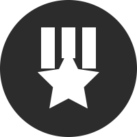

 

     <h1>廖舟</h1>
     

         
             
             182-8027-8028
         
         ·
         
             
             liaozhou98@qq.com
         
          
         
             
             <a href="https://github.com/COLD-PLAY">COLD-PLAY</a>
         
         ·
         
             求职意向：后台开发实习生
         
     

 

 ##  教育经历
 - 2015.9~2019.7 学士，电子科技大学，计算机科学与技术 
 - 2019.9~2022.7 硕士，电子科技大学，计算机技术
 - 硕士绩点：3.96，年级前1%；本科绩点：3.60，年级前25%
 - 英语水平：CET-4:555、CET-6:513，可无障碍进行日常交流及文献阅读

##  获奖经历
- 2019-2020年，研究生国家奖学金、学业一等奖学金
- 2020年，IEEEXtreme14排名130/2157
- 2020年，区块链技术网络安全应用创新大赛最佳推广奖
- 2020年，校企行创新创业大赛三等奖
- 2019年，百度大学生网络安全技能大赛团队第三名

##  项目经历
- **2020.8~2021.1，本地及局域网内信息收集项目**
  使用C++编写，利用Win32API获取Windows主机信息，包括软硬件、重要文件以及浏览记录等信息。同时利用TCP/ICMP对局域网进行扫描嗅探局域网内其它主机信息，包括指纹信息等。并将获取的信息利用AES进行加密保存。
- **2019.9~2020.12，基于网络流量的漏洞分析与检测技术研究项目**
  使用C++以及Python语言编写，为三零所104项目完成基于控制流完整性的程序控制流异常检测，构建攻击特征库，使用多种机器学习方法进行检测。防篡改控制流研究，构建程序正常情况下所有可能的控制流，生成全程序控制流图，并采用二进制重写技术检测网络攻击。对二进制程序进行插桩检测异常控制流跳转。
- **2019.6~2019.10，Ziiliqa GraphQL项目**
  使用Python作为开发语言，Flask作为框架，Neo4j作为数据库，为区块链公司Zilliqa提供数据查询服务，其中数据存放在Neo4j图形数据库中，并提供API查询以及Cypher语句查询两种方式。

##  科研经历
- **"Inline"：在投**
  学生一作，完成了数据的获取、清理以及分析，对760万开源合约其中的内联汇编部分的代码进行了详细的分析并得到了许多见解，发出了一份针对本研究的调查问卷并获得了较好的反响。
- **"SODA"：安全四大顶会NDSS收录**
  论文四作，论文使用Golang为开发语言，在现有区块链客户端中集成实现了一个跨链的可移植的信息收集平台，并提供了相应API以动态检测区块链恶意交易。本人完成了其中对重入攻击检测部分的代码并成功检测到了出现过的所有重入攻击交易，同时检测到了没有被记录的一些攻击。

##  性格与特长
- 活泼开朗，喜欢与人交流，擅长沟通合作，踏实负责
- 打羽毛球、跑步、骑行、魔方

##  技能清单
- 熟悉C++、Python语言
- 熟悉以太坊等区块链
- 了解JavaScript
